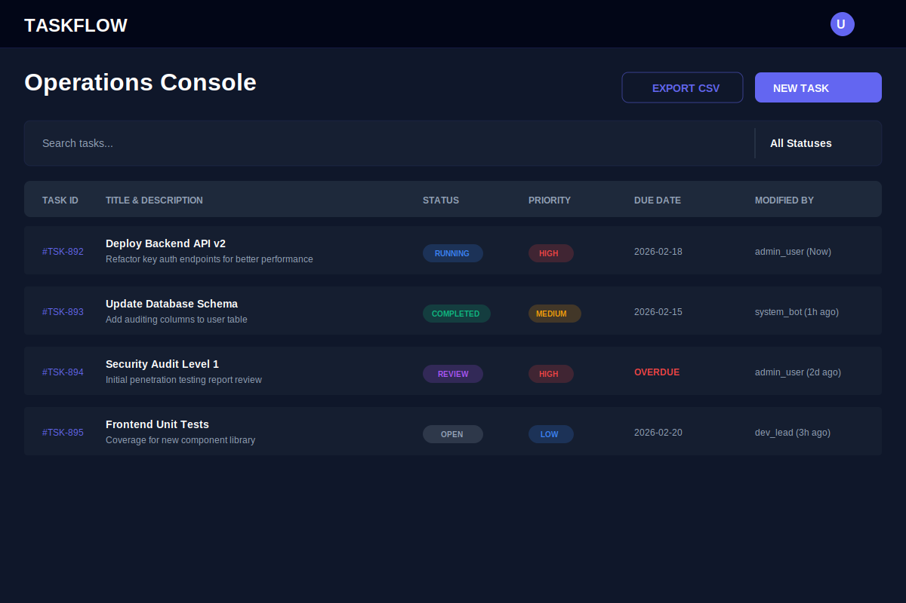
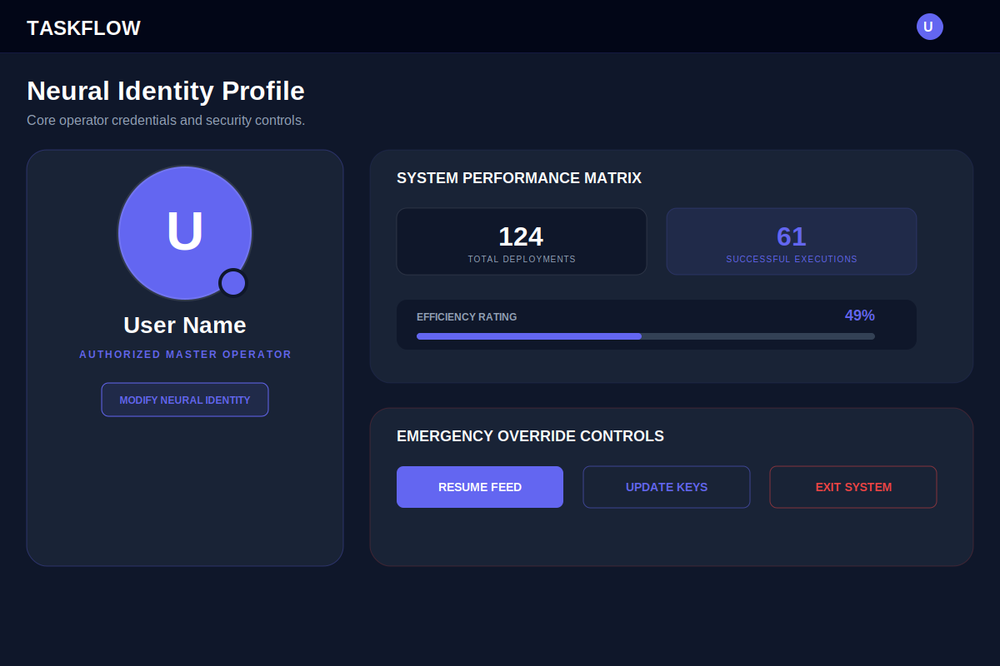

# 🚀 Task Management System - Application Support Edition


## 🌟 Overview

The **Task Management System** is a high-availability operational dashboard designed for enterprise application support teams. Unlike standard CRUD applications, this system is engineered as an **Operational Hub**, featuring deep data resilience, forensic audit trails, and a **"Cyber Intelligence"** UI theme optimized for long-term monitoring usage.

This project simulates a real-world NOC (Network Operations Center) environment where task clarity, quick status updates, and visual comfort are critical.

## 🎨 New "Cyber Intelligence" UI Theme

Transitioning from a standard emerald green to a specialized **Indigo & Cobalt Blue** palette, the new interface features:

- **Reduced Eye Strain**: Dark-mode optimized for 8+ hour shifts.
- **Glassmorphism**: High-blur cards with depth effects for a modern feel.
- **Micro-Interactions**: Subtle glows and hover states on all interactive elements.
- **Unified Aesthetic**: Consistent gradient headers and high-contrast typography across Dashboard, Task List, and Profile screens.

## ⚡ Key Features

### 1. **Modular "Section-Based" Architecture**

- Organized by business domain (`sections/tasks`, `pages/auth`) rather than technical type.
- Ensures scalability and easier team collaboration.

### 2. **Deep-Linked Routing**

- URL-driven navigation (`/dashboard/analysis`, `/dashboard/table`) allows bookmarking specific views.
- Browser "Back" button works seamlessly within the SPA.

### 3. **Smart Data Handling**

- **Word-Break Logic**: Zero-layout shift even with massive error logs/JSON strings in task descriptions.
- **Search & Filter**: Real-time filtering by status and text search across multiple fields.

### 4. **Forensic Audit Trail**

- **Restart Logic**: Canceled tasks are never "edited" back to Open; they are **cloned** into new tasks to preserve failure history.
- **Timestamp Precision**: Tracks modifications down to the nanosecond.

## 🛠️ Technology Stack

- **Frontend**: React 19, Material UI (MUI), Framer Motion (for animations).
- **Backend**: Spring Boot, Spring Security, JPA/Hibernate.
- **Database**: H2 (Dev) / PostgreSQL (Prod).
- **Authentication**: JWT (JSON Web Tokens) with secure HttpOnly cookies.

## 🚀 Getting Started

1.  **Clone the repository**:
    ```bash
    git clone https://github.com/yourusername/task-manager.git
    ```
2.  **Install Dependencies**:
    ```bash
    cd task-manager
    npm install
    ```
3.  **Run Development Server**:
    ```bash
    npm run dev
    ```
4.  **Backend Setup**:
    Ensure the Spring Boot service is running on entering `http://localhost:8080`.

## 📸 Application Intelligence Core

### 1. **Operations Dashboard**

_High-level situational awareness with Velocity Charts and Critical Team Activity Logs._


### 2. **Tactical Task Console**

_Data-dense grid with specialized 'Word-Break' logic for error logs and real-time status/priority indicators._


### 3. **Neural Identity Profile**

_Personalized command center with session security controls and individual efficiency metrics._


---

**Developed by**: Mohamed Yasar A.
